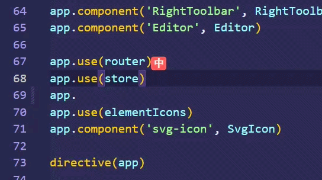
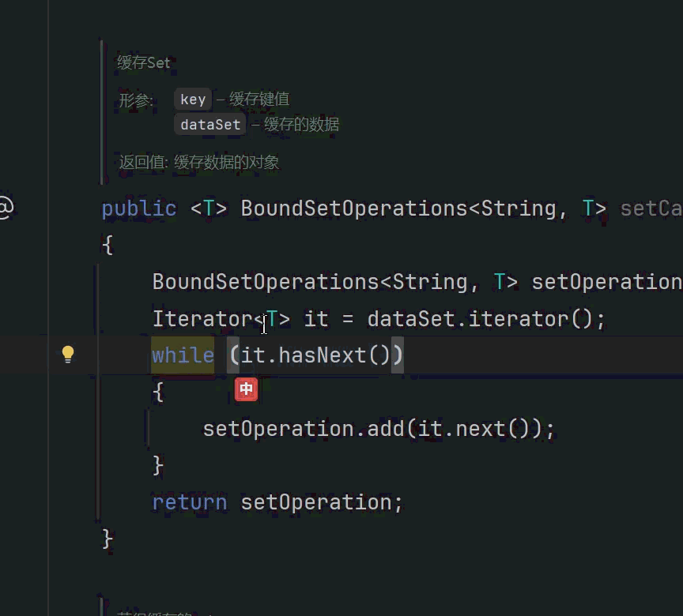

<p align="center">
  
</p>

<h1 align="center">Cursor IME HUD</h1>

<p align="center">
  在光标旁显示中文 / 英文输入法状态<br>
  支持 <strong>VS Code</strong>、<strong>Cursor</strong> 与 <strong>JetBrains IDE</strong>
</p>

<p align="center">
  <a href="https://github.com/GJYNBB/cursor-ime-hud/releases"></a>
  <a href="https://code.visualstudio.com/"></a>
  <a href="https://www.jetbrains.com/"></a>
  <a href="LICENSE"></a>
</p>

<p align="center">
  <a href="README.en.md">English</a> · 简体中文
</p>

---

写代码时最怕一件事：以为是英文，结果打出一串拼音。

**Cursor IME HUD** 会在编辑器主光标附近显示当前输入法状态，并同步到状态栏。只做提示，不切换输入法，也不读取你的输入内容。

## 效果预览

<table>
  <tr>
    <td align="center" width="50%">
      <strong>VS Code / Cursor</strong><br>
      
    </td>
    <td align="center" width="50%">
      <strong>JetBrains</strong><br>
      
    </td>
  </tr>
</table>

## 功能

- **光标旁 HUD**：紧贴主光标，显示 `中` / `英` 或 `ZH` / `EN`
- **状态栏同步**：底部常驻眼睛图标 + `输入法：中` / `英` / `?`（眼睛实时反映光标旁图标开关）；悬停可点击开启/关闭光标旁图标，或打开设置
- **两种显示模式**：图标 + 文字，或纯文字
- **跨平台检测**：Windows / macOS / Linux，由独立的 Rust helper 读取系统输入法状态
- **防抖与恢复**：短时未知状态会保留上次稳定结果；helper 异常时可手动刷新
- **隐私优先**：不读文件、不读剪贴板、不记录按键、不上传任何输入内容

## 支持范围

| 项目     | 说明                                                |
| -------- | --------------------------------------------------- |
| 编辑器   | VS Code `^1.107.0`、Cursor、JetBrains IDE `2026.1+` |
| 系统     | Windows 10/11、macOS、Linux                         |
| 架构     | x64 / arm64（Linux 另含 armhf）                     |
| 输入法   | 主要面向中文 IME；无法可靠识别时显示未知状态        |
| 多光标   | 仅主光标                                            |
| 自动切换 | **不支持**，也不会主动切换输入法                    |

## 安装

从 [GitHub Releases](https://github.com/GJYNBB/cursor-ime-hud/releases) 下载对应产物：

| 客户端                         | 文件                                       |
| ------------------------------ | ------------------------------------------ |
| VS Code / Cursor               | `cursor-ime-hud-<version>-<platform>.vsix` |
| VS Code / Cursor（通用离线包） | `cursor-ime-hud-<version>.vsix`            |
| JetBrains                      | `cursor-ime-hud-jetbrains-<version>.zip`   |

平台后缀示例：`win32-x64`、`win32-arm64`、`darwin-x64`、`darwin-arm64`、`linux-x64`、`linux-arm64`、`linux-armhf`。

### VS Code / Cursor

```bash
# VS Code
code --install-extension ./cursor-ime-hud-<version>-win32-x64.vsix

# Cursor
cursor --install-extension ./cursor-ime-hud-<version>-win32-x64.vsix
```

也可以在扩展面板选择 **从 VSIX 安装…**。

### JetBrains

**设置 → 插件 → 齿轮 → 从磁盘安装插件…**，选择下载的 ZIP。

## 快速开始

1. 安装扩展 / 插件并重新加载 IDE
2. 打开任意可编辑文件，将光标放在编辑区
3. 切换中文 / 英文输入状态
4. 观察光标旁标签与底部状态栏

默认标签为 `中 / 英`，可在设置中改为 `ZH / EN`。

## 配置

### VS Code / Cursor

| 设置                                           | 默认        | 说明                             |
| ---------------------------------------------- | ----------- | -------------------------------- |
| `cursorImeHud.overlay.enabled`                 | `true`      | 是否显示光标旁 HUD               |
| `cursorImeHud.overlay.labelPreset`             | `zh-en`     | `zh-en` → 中/英；`en-zh` → ZH/EN |
| `cursorImeHud.overlay.mode`                    | `text+icon` | `text+icon` 或 `text`            |
| `cursorImeHud.overlay.cnColor`                 | `#FF5252`   | 中文状态颜色                     |
| `cursorImeHud.overlay.enColor`                 | `#1E90FF`   | 英文状态颜色                     |
| `cursorImeHud.overlay.opacity`                 | `0.78`      | HUD 整体透明度（0.15–1）         |
| `cursorImeHud.overlay.backgroundEnabled`       | `true`      | 纯文字模式是否显示背景           |
| `cursorImeHud.overlay.backgroundOpacity`       | `0.72`      | 背景 / 图标底色透明度            |
| `cursorImeHud.overlay.offsetX`                 | `6`         | 水平偏移（-50 ~ 50）             |
| `cursorImeHud.overlay.offsetY`                 | `20`        | 垂直偏移（-50 ~ 50）             |
| `cursorImeHud.overlay.hideWhenEditorUnfocused` | `true`      | 窗口失焦时隐藏 HUD               |
| `cursorImeHud.statusBar.enabled`               | `true`      | 是否显示状态栏项                 |

### JetBrains

插件设置中提供同等核心选项：HUD / 状态栏开关、标签预设、颜色、透明度、偏移，以及失焦隐藏。

## 命令

| 命令                 | 作用                                  |
| -------------------- | ------------------------------------- |
| 开关光标旁输入法提示 | 打开 / 关闭 HUD                       |
| 刷新输入法状态       | 主动重新检测；helper 异常时可尝试恢复 |
| 显示诊断信息         | 查看检测器、生命周期与最近日志        |

状态栏标签悬停可点击开启/关闭光标旁图标，或打开设置。

## 隐私与安全

本项目只需要知道「当前是中文还是英文」，不需要知道「你输入了什么」。

- 不读取编辑器文件内容
- 不读取剪贴板
- 不记录、不上传按键或输入文本
- 不修改系统输入法状态
- helper 仅通过平台公开 API / 输入法框架查询状态，经 stdio 回传结构化结果
- 启动前校验 helper 的 `.sha256`；校验失败则禁用 native 路径

协议与生命周期说明：

- [docs/helper-protocol.md](docs/helper-protocol.md)
- [docs/helper-lifecycle.md](docs/helper-lifecycle.md)
- [SECURITY.md](SECURITY.md)

## 仓库结构

```text
cursor-ime-hud/
├── src/           # VS Code / Cursor 扩展（TypeScript）
├── native/        # 跨平台 IME helper（Rust）
├── jetbrains/     # JetBrains 插件（Kotlin）
├── resources/     # 图标、截图、打包 helper
├── docs/          # 协议与生命周期文档
└── scripts/       # 构建与打包脚本
```

JetBrains 插件单独说明见 [jetbrains/README.md](jetbrains/README.md)。

- [SignPath 代码签名政策](docs/SIGNPATH_CODE_SIGNING_POLICY.md)

## 本地开发

需要：Node.js 24+、npm 11+、Rust stable；构建 Windows helper 需 MSVC，macOS 需 Xcode CLT；JetBrains 开发需 JDK 21。

```bash
npm install
npm run compile
npm run lint
npm test

# 当前主机 helper
npm run build:helper

# 打平台 VSIX
npm run package:vsix:target -- --target win32-x64 --out-dir dist/vsix

# JetBrains
./jetbrains/gradlew -p jetbrains test
./jetbrains/gradlew -p jetbrains buildPlugin
```

完整贡献流程、PR 约定与架构说明：

- [CONTRIBUTING.md](CONTRIBUTING.md)
- [ARCHITECTURE.md](ARCHITECTURE.md)

## 故障排查

| 现象            | 建议                                                                              |
| --------------- | --------------------------------------------------------------------------------- |
| 看不到 HUD      | 确认光标在可编辑文本区；检查 HUD 是否已关闭；运行「显示诊断信息」                 |
| 状态栏一直 `?`  | 当前窗口可能不是有效 IME 上下文，或 helper 未能读取状态；先运行「刷新输入法状态」 |
| helper 启动失败 | 确认安装的是与本机架构匹配的官方包；不要单独替换 helper 或 `.sha256`              |
| Linux 检测异常  | 确认会话中可用 Fcitx / IBus / XKB 等后端；诊断信息中会标明当前后端                |

提交 issue 时请附上：IDE 版本、系统与架构、输入法名称、诊断输出（可打码路径），以及是否可稳定复现。

## 许可证

[MIT](LICENSE)
