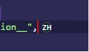

# Cursor IME HUD

[English](README.en.md) | 简体中文

[](https://github.com/GJYNBB/cursor-ime-hud/releases)
[](https://code.visualstudio.com/)
[](LICENSE)

**Cursor IME HUD** 是一个面向多 IDE 的输入法状态提示项目：它会在编辑器主光标附近显示当前中文/英文输入状态，并同步到状态栏，帮助你在写代码、写文档、聊天和搜索时减少“明明想输入英文却打出中文”的误输入。

当前仓库同时开源维护两个客户端：

- **VS Code / Cursor 扩展**：根目录 TypeScript 项目，发布为 VSIX / VS Code Marketplace 扩展。
- **JetBrains IDE 插件**：[`jetbrains/`](jetbrains/) 子项目，发布为 JetBrains Marketplace 插件。

两者共用同一套产品定位、图标资源和 Windows Rust native helper 协议。根 README 默认介绍 VS Code / Cursor 扩展；JetBrains 插件的开发与打包说明见 [`jetbrains/README.md`](jetbrains/README.md)。

它的目标很克制：**只提示输入法状态，不自动切换输入法，不读取文件内容、剪贴板或实际输入文本。**

## 目录

- [功能特性](#功能特性)
- [源码结构](#源码结构)
- [效果预览](#效果预览)
- [安装](#安装)
- [快速开始](#快速开始)
- [命令](#命令)
- [配置项](#配置项)
- [工作原理与隐私](#工作原理与隐私)
- [已知限制](#已知限制)
- [故障排查](#故障排查)
- [从源码开发](#从源码开发)
- [打包与发布](#打包与发布)
- [相关文档](#相关文档)
- [支持与安全](#支持与安全)
- [贡献](#贡献)

## 功能特性

- **光标旁 HUD**：在当前主光标附近显示轻量、半透明的输入状态标签。
- **可选 `中` / `英` 或 `ZH` / `EN` 标签**：默认保留中文标签，也可一键切换为拉丁字母标签。
- **状态栏同步显示**：即使 HUD 因未知状态或编辑器失焦而隐藏，状态栏仍会保留提示。
- **低噪声 unknown 处理**：探测不到可靠状态时隐藏 HUD，并在状态栏显示 `?`。
- **500ms 稳态宽限窗口**：降低 Windows IME 状态瞬时抖动造成的闪烁。
- **Windows native helper 探测**：通过独立 helper 读取前台窗口 IME 状态，扩展侧通过 JSONL 协议消费状态。
- **诊断命令**：内置 `Show Diagnostics`，便于定位 helper、协议、状态解析和生命周期问题。
- **不自动切换输入法**：只做显示，不改变用户的输入法和键盘布局。

## 源码结构

```text
cursor-ime-hud/
  src/                  # VS Code / Cursor 扩展源码
  native/               # Rust Windows IME helper 源码
  resources/            # VS Code 扩展图标、截图和 helper 打包产物
  jetbrains/            # JetBrains IDE 插件源码（Kotlin + Gradle）
  docs/                 # helper 协议等共享文档
  .github/workflows/    # VS Code Release 与 JetBrains 插件打包工作流
```

建议 issue / PR 都继续提交到同一个仓库。涉及 JetBrains 插件的问题请在标题或正文中注明 `JetBrains`，涉及 VS Code / Cursor 扩展的问题请注明 `VS Code` 或 `Cursor`。

## 效果预览



光标旁 HUD 会在编辑器主光标附近直接显示当前输入法状态，适合在代码、文档、搜索框和聊天输入场景中快速确认中英文模式。

## 安装

发布到 Marketplace 后，可以在 VS Code / Cursor 扩展市场搜索 **Cursor IME HUD** 并安装。

也可以从 GitHub Release 手动下载 VSIX：

- [下载 cursor-ime-hud-1.0.1.vsix](https://github.com/GJYNBB/cursor-ime-hud/releases/download/v1.0.1/cursor-ime-hud-1.0.1.vsix)

在 Windows 上安装：

```powershell
code --install-extension .\cursor-ime-hud-1.0.1.vsix
```

如果你使用 Cursor，也可以在扩展页面选择 **Install from VSIX...**，然后选择下载的 `.vsix` 文件。

> 当前发布版只包含 Rust 构建的 Windows helper。安装 Marketplace 或 VSIX 包不需要额外安装 Rust、.NET、C# 工具链、MSVC 或 PowerShell。

## 快速开始

1. 安装 VSIX。
2. 在 VS Code / Cursor 中打开任意文本文件。
3. 将光标放到可编辑文本区域。
4. 在 Windows 中文输入法中切换中文 / 英文输入状态。
5. 观察光标附近的 `中` / `英` HUD，以及状态栏中的同步提示。
6. 如果更喜欢拉丁字母标签，可将 `cursorImeHud.overlay.labelPreset` 设为 `en-zh`，显示会变为 `ZH` / `EN`。

如果没有看到 HUD，请先运行命令：

```text
Cursor IME HUD: Show Diagnostics
```

并查看 VS Code Output 面板里的 **Cursor IME HUD** 输出通道。

## 命令

| 命令                                | 说明                                       |
| ----------------------------------- | ------------------------------------------ |
| `Cursor IME HUD: Toggle Overlay`    | 开启或关闭光标旁 HUD。                     |
| `Cursor IME HUD: Refresh IME State` | 主动刷新一次 IME 状态。                    |
| `Cursor IME HUD: Show Diagnostics`  | 显示当前探测器、快照、生命周期和最近日志。 |

## 配置项

| 设置                                           | 默认值    | 说明                                                                                    |
| ---------------------------------------------- | --------- | --------------------------------------------------------------------------------------- |
| `cursorImeHud.overlay.enabled`                 | `true`    | 是否启用光标旁 HUD。                                                                    |
| `cursorImeHud.overlay.labelPreset`             | `custom`  | 标签预设：`custom` 使用自定义标签，`zh-en` 显示 `中` / `英`，`en-zh` 显示 `ZH` / `EN`。 |
| `cursorImeHud.overlay.cnLabel`                 | `中`      | `labelPreset` 为 `custom` 时的中文输入状态显示标签。                                    |
| `cursorImeHud.overlay.enLabel`                 | `英`      | `labelPreset` 为 `custom` 时的英文输入状态显示标签。                                    |
| `cursorImeHud.overlay.cnColor`                 | `#4FA6FF` | 中文输入状态标签颜色（适用于 `中` / `ZH` 或自定义中文标签）。                           |
| `cursorImeHud.overlay.enColor`                 | `#FF6B6B` | 英文输入状态标签颜色（适用于 `英` / `EN` 或自定义英文标签）。                           |
| `cursorImeHud.overlay.backgroundEnabled`       | `true`    | 是否在标签背后显示圆角矩形背景遮罩。                                                    |
| `cursorImeHud.overlay.backgroundOpacity`       | `0.72`    | 背景遮罩透明度，范围 `0` 到 `1`。                                                       |
| `cursorImeHud.overlay.opacity`                 | `0.78`    | HUD 标签透明度，范围 `0.15` 到 `1`。                                                    |
| `cursorImeHud.overlay.mode`                    | `text`    | HUD 渲染模式；`text+icon` 当前为预留模式，表现与 `text` 相同。                          |
| `cursorImeHud.statusBar.enabled`               | `true`    | 是否在状态栏显示输入状态。                                                              |
| `cursorImeHud.overlay.hideWhenEditorUnfocused` | `true`    | VS Code 窗口失焦时是否隐藏 HUD。                                                        |
| `cursorImeHud.overlay.offsetX`                 | `6`       | HUD 横向偏移。                                                                          |
| `cursorImeHud.overlay.offsetY`                 | `20`      | HUD 纵向偏移，可调到 `30`。                                                             |

> VS Code / Cursor 设置页和命令标题会跟随编辑器显示语言自动本地化：中文界面显示中文说明，英文或未支持语言回退到英文。设置 ID（例如 `cursorImeHud.overlay.enabled`）保持不变。

## 工作原理与隐私

扩展由两部分组成：

1. **VS Code 扩展侧**：负责命令、配置、状态栏、HUD 渲染、诊断输出和 helper 生命周期管理。
2. **Windows native helper**：负责读取前台窗口 IME 状态，并通过 stdio 发送 line-delimited JSON 消息。

当前仓库和新发布版本只包含 Rust 构建的 `WinImeWatcher.exe` helper。早期 classic/.NET helper 只保留在历史 GitHub Release（例如 `v0.0.1` / `v0.0.2`）中，不再作为当前实现维护。

helper 主要使用 Windows IMM32 API（例如 `ImmGetOpenStatus`、`ImmGetDescription`）和 `GetKeyboardLayout`，识别中文 IME 的 Win32 primary language id `0x0004`。协议细节见 [docs/helper-protocol.md](docs/helper-protocol.md)，整体架构见 [ARCHITECTURE.md](ARCHITECTURE.md)。

隐私边界：

- 不读取文件内容；
- 不读取剪贴板；
- 不读取实际输入文本；
- 不记录你输入了什么；
- helper 只检查前台窗口的 IME 状态。

打包产物中包含：

```text
resources/bin/win-x64/WinImeWatcher.exe
resources/bin/win-x64/WinImeWatcher.exe.sha256
```

`.sha256` sidecar 用于运行时完整性校验。如果二进制与 sidecar 不匹配，扩展会禁用 native helper 并回退到 sample detector。

## 已知限制

- 目前仅支持 Windows。
- 当前只打包 `win-x64` native helper。
- 当前 native helper 只检测中文 IME；日语、韩语和其他 CJK 输入法可能被报告为 `en` 或 `unknown`。
- v1 只渲染主光标，不支持多光标分别显示。
- `text+icon` 目前只是预留模式，还没有真正的图标渲染。
- helper 是 Rust 编译的单文件可执行程序，因此 VSIX 体积会比纯 TypeScript 扩展更大。

## 故障排查

### HUD 不显示

1. 确认系统是 Windows 10 / Windows 11。
2. 确认 VS Code 版本满足 `^1.107.0`。
3. 打开 **Output** 面板，选择 **Cursor IME HUD** 输出通道。
4. 运行 `Cursor IME HUD: Show Diagnostics`。
5. 检查 VSIX 或源码目录中是否存在：
   - `resources/bin/win-x64/WinImeWatcher.exe`
   - `resources/bin/win-x64/WinImeWatcher.exe.sha256`

### 状态栏一直显示 `?`

可能原因：

- 当前窗口不是可靠的中文 IME 上下文；
- 正在使用非中文 IME；
- helper 暂时无法读取前台窗口状态；
- helper 启动失败、退出或完整性校验失败。

可以先运行：

```text
Cursor IME HUD: Refresh IME State
```

如果仍然无法恢复，请把 Diagnostics 输出和 Output 日志带到 [Issues](https://github.com/GJYNBB/cursor-ime-hud/issues) 反馈。

### 扩展激活失败

- 检查 VS Code 版本是否满足 `^1.107.0`。
- 打开扩展页查看激活错误。
- 打开 Output 面板查看完整堆栈。
- 如果能稳定复现，请提交 issue，并附上环境信息、日志和复现步骤。

## 从源码开发

### 环境要求

- Windows 10 / Windows 11
- VS Code `^1.107.0`
- Node.js 24+
- npm 11+
- Rust stable toolchain（`cargo`）
- Windows MSVC Build Tools / Visual Studio C++ 工具链
- PowerShell 7+ 或 Windows PowerShell

Rust 和 MSVC 工具链只在从源码构建 native helper 时需要。安装已经打包好的 VSIX 不需要额外安装 Rust。

### 本地开发

```powershell
npm install
npm run compile
npm run build:helper
npm run lint
```

`npm run build:helper` 会生成：

```text
resources/bin/win-x64/WinImeWatcher.exe
resources/bin/win-x64/WinImeWatcher.exe.sha256
```

### 调试扩展

1. 用 VS Code 打开仓库。
2. 运行：

   ```powershell
   npm install
   npm run compile
   npm run build:helper
   ```

3. 按 `F5`，选择 `Run Cursor IME HUD`。
4. 在 Extension Development Host 中打开文本文件并切换中文 / 英文输入状态。

仓库已经包含 `.vscode/launch.json` 和 `.vscode/tasks.json`，方便本地调试 helper 构建和 TypeScript watch 流程。

### 测试

```powershell
npm test
```

测试流程包括：

- TypeScript 编译；
- native helper 构建；
- helper `--once` 协议 smoke test；
- 扩展行为测试；
- unknown / fallback / render cache / helper parsing / detector fallback 等重点路径测试。

在没有 Windows helper 构建环境的机器上，可以先运行：

```powershell
npm run compile
npm run lint
npm run test:unit
```

## 打包与发布

### 本地打包 VSIX

```powershell
npm run package:vsix
```

这会生成类似下面的文件：

```text
cursor-ime-hud-1.0.1.vsix
```

本地安装：

```powershell
code --install-extension .\cursor-ime-hud-1.0.1.vsix
```

### GitHub Release 打包

Release workflow 会在 `windows-latest` runner 上执行完整构建流程：

1. 安装依赖；
2. 运行 publisher pre-flight 检查；
3. 编译 TypeScript；
4. 构建 native helper 和 `.sha256` sidecar；
5. 打包 VSIX；
6. 上传 VSIX artifact / release asset。

### VS Code Marketplace 发布

当前 Marketplace publisher id：

```text
chestnut-ch
```

手动发布：

```powershell
npx @vscode/vsce login chestnut-ch
npx @vscode/vsce publish
```

建议先通过 GitHub Release 下载 VSIX 并完成手动测试，确认无误后再发布到 VS Code Marketplace。

## 项目结构

```text
.
├─ native/WinImeWatcher/      # Windows native helper
├─ resources/                 # 图标、helper 二进制和截图资源
├─ scripts/                   # 构建、打包、校验脚本
├─ src/                       # VS Code 扩展源码
├─ docs/helper-protocol.md    # helper JSONL 协议说明
├─ ARCHITECTURE.md            # 架构说明
├─ CHANGELOG.md               # 更新日志
├─ README.md                  # 中文主页
└─ README.en.md               # English README
```

## 相关文档

- [English README](README.en.md)
- [架构说明](ARCHITECTURE.md)
- [Helper 协议](docs/helper-protocol.md)
- [更新日志](CHANGELOG.md)
- [贡献指南](CONTRIBUTING.md)

## 支持与安全

- 使用和排障请先阅读 [SUPPORT.md](SUPPORT.md)，并在反馈问题时附上 `Cursor IME HUD: Show Diagnostics` 输出和 **Cursor IME HUD** Output 日志。
- 安全问题请按 [SECURITY.md](SECURITY.md) 报告，不要在公开 issue 中粘贴可利用细节或敏感日志。
- 参与讨论和贡献时请遵守 [CODE_OF_CONDUCT.md](CODE_OF_CONDUCT.md)。

## 贡献

欢迎提交 issue 和 pull request。建议在提交前先运行：

```powershell
npm run compile
npm run lint
```

如果改动涉及 native helper，请在 Windows 环境运行：

```powershell
npm run build:helper
npm test
```

更多本地开发和发布说明见 [CONTRIBUTING.md](CONTRIBUTING.md)。

## License

本项目使用 [MIT License](LICENSE)。
